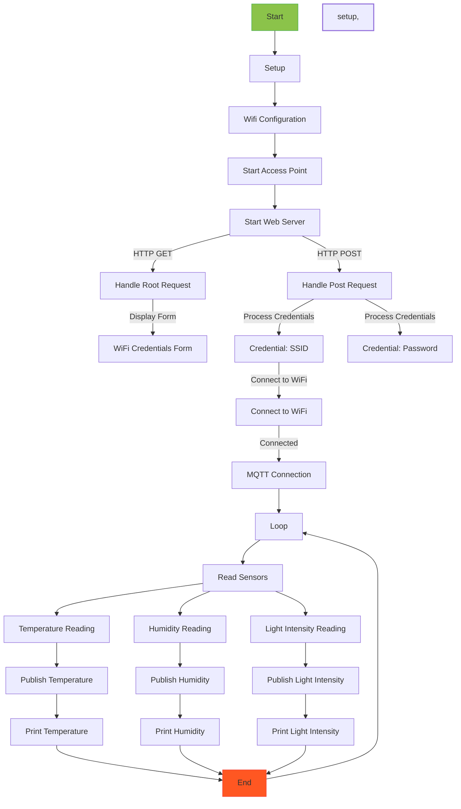

# IoT Sensor Data Publisher with ESP8266

This project is an example of how to read temperature, humidity, and light intensity data from sensors using an ESP8266 microcontroller and publish the data to the Adafruit IO MQTT broker. The code is designed to be simple and straightforward, allowing you to quickly set up an IoT sensor data publishing system.

## Dependencies

Make sure to install the following libraries before using this code:

- ESP8266WiFi.h
- Adafruit_MQTT.h
- Adafruit_MQTT_Client.h
- DHT.h
- WiFiClient.h
- ESP8266WebServer.h

## Configuration

Before using the code, update the following configuration parameters to match your setup:

- `MQTT_SERVER:` The MQTT broker server (e.g., Adafruit IO MQTT broker).
- `MQTT_PORT:` The MQTT broker port (usually 1883).
- `MQTT_USERNAME:` Your Adafruit IO username.
- `MQTT_KEY:` Your Adafruit IO secret key.
- `TEMP_HUMIDITY_PIN:` The pin to which the temperature and humidity sensor is connected.
- `LIGHT_INTENSITY_PIN:` The pin to which the light intensity sensor is connected.
- `DHTTYPE:` The type of DHT sensor, which can be DHT11, DHT21, or DHT22.

## Usage

1. **Setup:**

   - Modify the configuration parameters as explained above.
   - Upload the code to your ESP8266 board using the Arduino IDE or any other compatible IDE.

2. **Hardware Connections:**

   - Connect the temperature, humidity, and light intensity sensors to the appropriate pins on the ESP8266 board.

3. **Wi-Fi Configuration:**

   - When the board starts up, it creates a Wi-Fi access point.
   - Connect your smartphone or computer to the access point.
   - Access the web server hosted on the board to enter your Wi-Fi network credentials `(on v2)`.
   - This step allows the board to connect to your Wi-Fi network.

4. **Start Publishing:**

   - Once connected to Wi-Fi, the board will connect to the MQTT broker (Adafruit IO).
   - The board will start publishing sensor data (temperature, humidity, and light intensity) every 10 seconds to the following MQTT topics:
     - `your_username/feeds/temperature`
     - `your_username/feeds/humidity`
     - `your_username/feeds/light-intensity`

5. **Data Visualization:**

   - You can view the published data on the Adafruit IO dashboard or use it for other purposes.

## flowchart

## Note

- Ensure that you have a stable internet connection and access to the Adafruit IO server for the MQTT communication to work properly.
- Take precautions while handling electronic components and connections to avoid any damage to the hardware.
