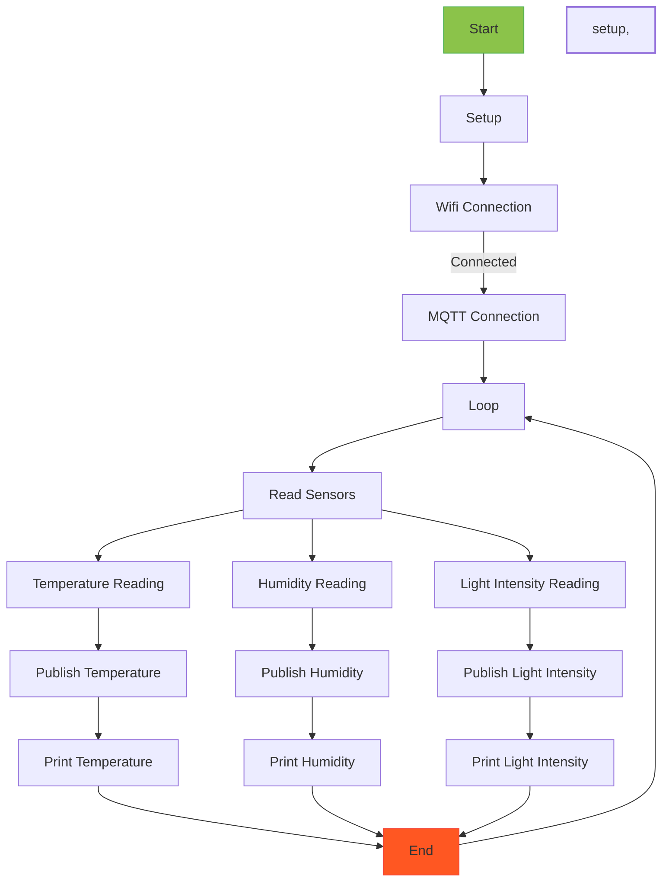

# ESP8266 Sensor Data Publisher

This project demonstrates how to use an ESP8266-based board to read temperature, humidity, and light intensity data from sensors and publish this data to an MQTT broker (Adafruit IO). The data can be visualized and analyzed on the Adafruit IO platform or used for further processing and automation.

## Requirements

- ESP8266-based board (e.g., NodeMCU, Wemos D1 Mini, etc.)
- DHT11 temperature and humidity sensor
- Light intensity sensor (e.g., LDR - Light Dependent Resistor)
- Arduino IDE with ESP8266 core support
- Adafruit_MQTT and Adafruit_MQTT_Client libraries

## Setup

1. **Connect the Hardware:**

   - Connect the DHT11 sensor to the appropriate pin on your ESP8266 board (TEMP_HUMIDITY_PIN in the code).
   - Connect the light intensity sensor (LDR) to the analog input pin on your ESP8266 board (LIGHT_INTENSITY_PIN in the code).

2. **Install Required Libraries:**

   - In the Arduino IDE, go to `Sketch -> Include Library -> Manage Libraries`.
   - Search for "DHT" and install the "DHT sensor library" by Adafruit.
   - Search for "Adafruit MQTT" and install both the "Adafruit MQTT Library" and "Adafruit MQTT Client Library".

3. **Configure WiFi and MQTT Settings:**

   - Replace the placeholders in the code with your actual WiFi SSID, WiFi password, Adafruit MQTT server details, username, and key.
   - Obtain your Adafruit IO username and key from the Adafruit IO website.

4. **Upload the Code:**

   - Connect your ESP8266 board to your computer and select the appropriate board and port in the Arduino IDE.
   - Upload the code to your board.

5. **Monitor the Output:**

   - Open the Arduino Serial Monitor (baud rate: 9600) to see the sensor data readings and ensure that the ESP8266 successfully connects to the WiFi and MQTT broker.

## flowchart

## Usage

- The ESP8266 board reads the temperature, humidity, and light intensity data from the connected sensors every 10 seconds and publishes it to the corresponding MQTT feeds on Adafruit IO.
- The sensor data can be visualized on Adafruit IO's dashboard or accessed via MQTT subscriptions.
- You can modify the code to add more sensors or perform additional actions based on the sensor data.

## Note

- Ensure that you have a stable internet connection and access to the Adafruit IO server for the MQTT communication to work properly.
- Always be cautious while handling electronic components and connections to avoid any damage to the hardware.

## Troubleshooting

- If the ESP8266 fails to connect to the WiFi network, double-check your WiFi SSID and password.
- If the MQTT connection fails, verify that you have provided the correct Adafruit MQTT server details, username, and key.
- Check your wiring to ensure proper connections between the sensors and the ESP8266 board.

## Credits

This project uses the following libraries:

- Adafruit MQTT Library: https://github.com/adafruit/Adafruit_MQTT_Library
- Adafruit MQTT Client Library: https://github.com/adafruit/Adafruit_MQTT_Library
- DHT Sensor Library: https://github.com/adafruit/DHT-sensor-library
