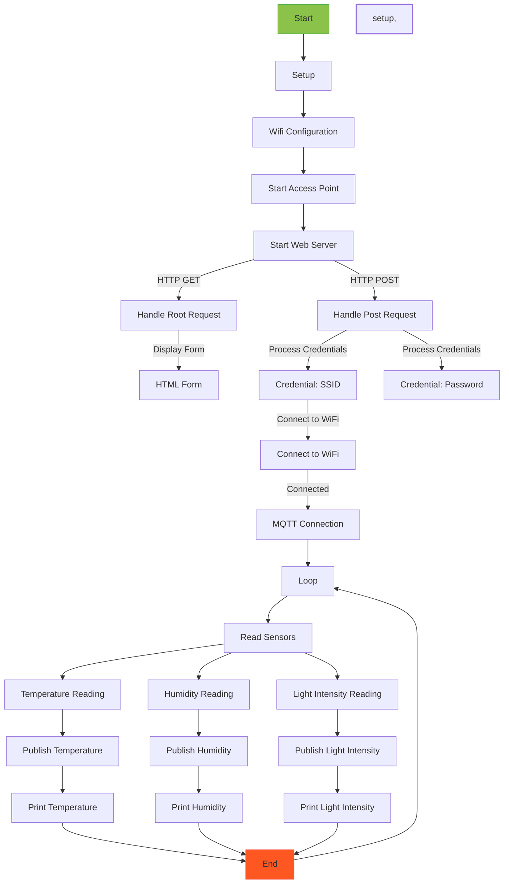

# ESP8266 Sensor Data Publisher with WiFi Configuration

This project demonstrates how to use an ESP8266-based board to read temperature, humidity, and light intensity data from sensors and publish this data to an MQTT broker (Adafruit IO). Additionally, it allows users to configure the WiFi credentials using a web form, enabling easy setup of the device without the need to hardcode WiFi details.

## Requirements

- ESP8266-based board (e.g., NodeMCU, Wemos D1 Mini, etc.)
- DHT11 temperature and humidity sensor
- Light intensity sensor (e.g., LDR - Light Dependent Resistor)
- Arduino IDE with ESP8266 core support
- Adafruit_MQTT and Adafruit_MQTT_Client libraries
- ESP8266WebServer library

## Setup

1. **Connect the Hardware:**

   - Connect the DHT11 sensor to the appropriate pin on your ESP8266 board (TEMP_HUMIDITY_PIN in the code).
   - Connect the light intensity sensor (LDR) to the analog input pin on your ESP8266 board (LIGHT_INTENSITY_PIN in the code).

2. **Install Required Libraries:**

   - In the Arduino IDE, go to `Sketch -> Include Library -> Manage Libraries`.
   - Search for "DHT" and install the "DHT sensor library" by Adafruit.
   - Search for "Adafruit MQTT" and install both the "Adafruit MQTT Library" and "Adafruit MQTT Client Library".
   - Search for "ESP8266WebServer" and install the library by ESP8266.

3. **Configure MQTT Settings:**

   - Replace the placeholders in the code with your actual Adafruit MQTT server details, username, and key.
   - Obtain your Adafruit IO username and key from the Adafruit IO website.

4. **Upload the Code:**

   - Connect your ESP8266 board to your computer and select the appropriate board and port in the Arduino IDE.
   - Upload the code to your board.

5. **WiFi Configuration:**

   - After uploading the code, power up the ESP8266 board.
   - The board will create an access point named "ESP8266_AP" with the password "password".
   - Connect your computer or mobile device to the access point.

6. **Configure WiFi Credentials:**

   - Open a web browser and navigate to `http://192.168.4.1/`.
   - You will be presented with a web page that allows you to enter your WiFi SSID and password.
   - Enter the credentials and click the "Submit" button.

7. **Monitor the Output:**

   - The ESP8266 will attempt to connect to the WiFi network with the provided credentials.
   - Once connected to WiFi, it will establish a connection with the MQTT broker (Adafruit IO).
   - The sensor data (temperature, humidity, and light intensity) will be published to the corresponding MQTT feeds on Adafruit IO.
   - You can monitor the sensor data and device status on the Serial Monitor of the Arduino IDE.

## flowchart

## Usage

- The ESP8266 board reads the temperature, humidity, and light intensity data from the connected sensors every 10 seconds and publishes it to the corresponding MQTT feeds on Adafruit IO.
- The device can be used to monitor environmental conditions and can be integrated into larger IoT projects.
- The WiFi configuration feature allows for easy setup without the need to reprogram the device for different WiFi networks.

## Note

- Ensure that you have a stable internet connection and access to the Adafruit IO server for the MQTT communication to work properly.
- Always be cautious while handling electronic components and connections to avoid any damage to the hardware.

## Troubleshooting

- If the ESP8266 fails to connect to the WiFi network, double-check your WiFi credentials.
- If the MQTT connection fails, verify that you have provided the correct Adafruit MQTT server details, username, and key.
- Check your wiring to ensure proper connections between the sensors and the ESP8266 board.

## Credits

This project uses the following libraries:

- Adafruit MQTT Library: https://github.com/adafruit/Adafruit_MQTT_Library
- Adafruit MQTT Client Library: https://github.com/adafruit/Adafruit_MQTT_Library
- DHT Sensor Library: https://github.com/adafruit/DHT-sensor-library
- ESP8266WebServer Library: https://github.com/esp8266/ESPWebServer

## License

This project is licensed under the [MIT License](LICENSE).
